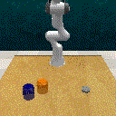
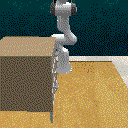
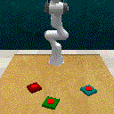
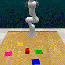
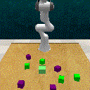
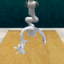

# ExPERACT
Explainable PERACT for robotic manipulation











The demonstration data is downloaded from Project PreAct. Train (100 episodes), validation (25 episodes), and test (25 episodes)

--  https://drive.google.com/drive/folders/0B2LlLwoO3nfZfkFqMEhXWkxBdjJNNndGYl9uUDQwS1pfNkNHSzFDNGwzd1NnTmlpZXR1bVE?resourcekey=0-jRw5RaXEYRLe2W6aNrNFEQ

```
export COPPELIASIM_ROOT_DIR="$HOME/Data/python/RLBench/CoppeliaSim_Edu_V4_1_0_Ubuntu16_04"

export COPPELIASIM_ROOT="$HOME/Data/python/RLBench/CoppeliaSim_Edu_V4_1_0_Ubuntu16_04"

export LD_LIBRARY_PATH=/usr/lib:/usr/lib64:$LD_LIBRARY_PATH:$COPPELIASIM_ROOT_DIR

export QT_QPA_PLATFORM_PLUGIN_PATH=$COPPELIASIM_ROOT_DIR

export HYDRA_FULL_ERROR=1

cd /directory/to/experact/

python main.py
```